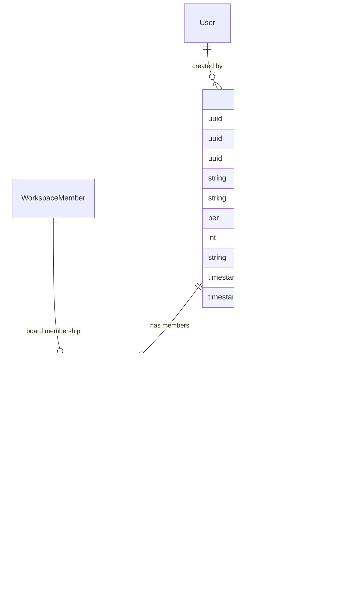
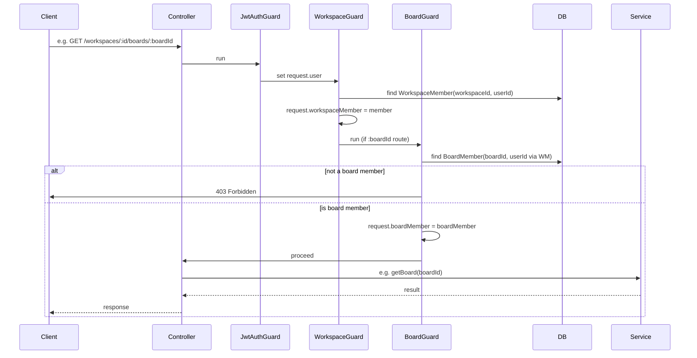

# Board Module Documentation

This document describes the board feature: boards within workspaces, board membership, and columns (with optional tasks). Boards are scoped to a workspace; only workspace members can be added as board members.

---

## Table of Contents

1. [Overview](#overview)
2. [Module Structure](#module-structure)
3. [Entity Model & Relationships](#entity-model--relationships)
4. [Entities](#entities)
5. [DTOs](#dtos)
6. [Request Flow: Guards & Decorators](#request-flow-guards--decorators)
7. [API Endpoints](#api-endpoints)
8. [Service Methods](#service-methods)
9. [Role Requirements](#role-requirements)
10. [Transactions & Cascade](#transactions--cascade)

---

## Overview

The board module lets workspace members:

- **Create boards** in a workspace (name, optional description); the creator is added as the first board member.
- **List boards** in a workspace (only boards the user is a member of), with member count and column count.
- **View a single board** with columns (ordered) and members (with user profiles).
- **Update or delete** a board (any board member can update; only workspace OWNER/ADMIN can delete).
- **Manage board members**: add or remove workspace members as board members (OWNER/ADMIN only).
- **Manage columns**: create, rename, reorder, and delete columns. Column deletion is blocked if the column has tasks.

Access is enforced by **JwtAuthGuard**, **WorkspaceGuard** (user must be a workspace member), and **BoardGuard** on routes with `:boardId` (user must be a board member). The board guard attaches the current user’s **BoardMember** to `request.boardMember`, available via **`@CurrentBoardMember()`** when needed.

---

## Module Structure

```
src/board/
├── entities/
│   ├── board.entity.ts
│   ├── board-member.entity.ts
│   └── board-column.entity.ts
├── dto/
│   ├── create-board.dto.ts
│   ├── update-board.dto.ts
│   ├── add-board-member.dto.ts
│   ├── create-column.dto.ts
│   ├── rename-column.dto.ts
│   └── reorder-columns.dto.ts
├── guards/
│   └── board.guard.ts
├── decorators/
│   └── current-board-member.decorator.ts
├── board.controller.ts
├── board.service.ts
├── board.module.ts
└── BOARD_MODULE.md
```

Shared type (used by guard and decorator):

```
src/types/board/
└── board-request.type.ts   # RequestWithBoardMember
```

---

## Entity Model & Relationships



**Relationship summary:**

| From            | To             | Relation  | Description                                  |
|----------------|----------------|-----------|----------------------------------------------|
| Workspace      | Board          | OneToMany | A workspace has many boards                  |
| User           | Board          | ManyToOne | Each board has a creator (createdById)      |
| Board          | BoardMember    | OneToMany | A board has many board members              |
| Board          | BoardColumn    | OneToMany | A board has many columns                     |
| WorkspaceMember| BoardMember    | ManyToOne | Each board membership references one WM     |
| BoardColumn    | Task           | OneToMany | A column can have many tasks (minimal)      |

**Unique constraint:** `(boardId, workspaceMemberId)` on **BoardMember** — a workspace member can only be added once per board.

**Table name:** Columns are stored in table **`board_columns`** (not `columns`) because `columns` is reserved in PostgreSQL.

---

## Entities

### Board

| Field        | Type     | Constraints   | Description                    |
|-------------|----------|---------------|--------------------------------|
| id          | uuid     | PK            | Primary key.                    |
| workspaceId | uuid     | FK → Workspace| Workspace this board belongs to.|
| workspace   | Workspace| ManyToOne     | Workspace relation.             |
| createdById | uuid     | FK → User     | User who created the board.    |
| createdBy   | User     | ManyToOne     | Creator relation.               |
| name        | varchar  | required      | Board name.                     |
| prefix      | varchar(5) | required, unique per workspace | Short code from name (e.g. FB, FLO); used for task codes. |
| taskCount   | int      | default 0     | Number of tasks created on this board; incremented on task creation. |
| description | varchar  | nullable      | Optional description.           |
| members     | BoardMember[] | OneToMany | Board members.                 |
| columns     | BoardColumn[] | OneToMany  | Board columns.                 |
| createdAt   | timestamp| —             | Creation time.                  |
| updatedAt   | timestamp| —             | Last update time.               |

### BoardMember

| Field             | Type        | Constraints      | Description                    |
|------------------|-------------|------------------|--------------------------------|
| id               | uuid        | PK               | Primary key.                    |
| boardId          | uuid        | FK → Board       | Board id.                      |
| board            | Board       | ManyToOne        | Board relation (CASCADE delete).|
| workspaceMemberId| uuid        | FK → WorkspaceMember | Workspace member id.      |
| workspaceMember  | WorkspaceMember | ManyToOne     | Workspace member (with user).  |
| addedAt          | timestamp   | CreateDateColumn | When the member was added.     |

**Unique constraint:** `(boardId, workspaceMemberId)`.

### BoardColumn

| Field     | Type     | Constraints   | Description                    |
|----------|----------|---------------|--------------------------------|
| id       | uuid     | PK            | Primary key.                    |
| boardId  | uuid     | FK → Board    | Board id.                      |
| board    | Board    | ManyToOne     | Board relation (CASCADE delete).|
| name     | varchar  | required      | Column name.                    |
| order    | integer  | default 0     | Display order (ascending).      |
| tasks    | Task[]   | OneToMany     | Tasks in this column.           |
| createdAt| timestamp| CreateDateColumn | When the column was created. |

**Table name:** `board_columns`.

**Prefix generation (on board create):** The board **prefix** is derived from the board name: first letter of each word (uppercase, max 5 chars), or for a single word of length ≥ 3 the first 3 characters (e.g. "Frontend Board" → `FB`, "FlowBoard" → `FLO`). It is unique per workspace; a numeric suffix is added if the base prefix is already taken. The prefix is used by the **Task** module to generate task codes (e.g. `FB-001`).

**Task entity:** Tasks live in the **Task module** (`src/task/`). The **Task** entity is referenced here so that **deleteColumn** can count tasks before allowing column deletion. See **TASK_MODULE.md** for full task documentation.

---

## DTOs

| DTO                 | Purpose              | Fields / Notes |
|---------------------|----------------------|----------------|
| **CreateBoardDto**  | Create board         | `name` (required), `description` (optional) |
| **UpdateBoardDto**  | Update board         | `name?`, `description?` (both optional)   |
| **AddBoardMemberDto** | Add member to board | `workspaceMemberId` (required, UUID)       |
| **CreateColumnDto** | Create column        | `name` (required)                            |
| **RenameColumnDto** | Rename column        | `name` (required)                            |
| **ReorderColumnsDto** | Reorder columns    | `columns` (array of `{ id: string, order: number }`, required) |

Validation uses `class-validator` (e.g. `@IsString()`, `@IsUUID()`, `@IsNumber()`, `@MaxLength(...)`, `@ValidateNested()`).

---

## Request Flow: Guards & Decorators

All board routes sit under **`/workspaces/:workspaceId/boards`**. They use:

1. **JwtAuthGuard** — ensures a valid JWT and sets `request.user` (e.g. `user.sub`).
2. **WorkspaceGuard** — ensures the user is a member of the workspace and sets `request.workspaceMember` (including role).
3. **BoardGuard** (only on routes with **`:boardId`**) — ensures the user is a board member by loading **BoardMember** joined with **WorkspaceMember** where `workspaceMember.userId === request.user.sub`; attaches it to `request.boardMember`.



**Type:** `src/types/board/board-request.type.ts`:

```ts
export type RequestWithBoardMember = RequestWithWorkspaceMember & {
  boardMember: BoardMember;
};
```

**Decorator:** `@CurrentBoardMember()` returns `request.boardMember` for use in controllers when the current user’s board membership is needed.

---

## API Endpoints

Base path: **`/workspaces/:workspaceId/boards`**.

All routes require a valid **JWT** and **WorkspaceGuard** (user must be a workspace member). Routes that include **`:boardId`** also use **BoardGuard** (user must be a board member).

| Method | Path | Guards | Role check | Description |
|--------|------|--------|-------------|-------------|
| **POST**   | `/workspaces/:workspaceId/boards` | Jwt, Workspace | — | Create board; creator is added as board member. |
| **GET**    | `/workspaces/:workspaceId/boards` | Jwt, Workspace | — | List boards the user is a member of (with memberCount, columnCount). |
| **GET**    | `/workspaces/:workspaceId/boards/:boardId` | Jwt, Workspace, Board | — | Get one board with columns (by order) and members (with user profiles). |
| **PATCH**  | `/workspaces/:workspaceId/boards/:boardId` | Jwt, Workspace, Board | — | Update board name and/or description. |
| **DELETE** | `/workspaces/:workspaceId/boards/:boardId` | Jwt, Workspace, Board | OWNER or ADMIN | Delete board (cascade deletes members, columns, tasks). |
| **POST**   | `/workspaces/:workspaceId/boards/:boardId/members` | Jwt, Workspace, Board | OWNER or ADMIN | Add a workspace member as a board member (body: `workspaceMemberId`). |
| **DELETE** | `/workspaces/:workspaceId/boards/:boardId/members/:workspaceMemberId` | Jwt, Workspace, Board | OWNER or ADMIN | Remove a board member. |
| **POST**   | `/workspaces/:workspaceId/boards/:boardId/columns` | Jwt, Workspace, Board | — | Create column (name; order = max + 1). |
| **PATCH**  | `/workspaces/:workspaceId/boards/:boardId/columns/reorder` | Jwt, Workspace, Board | — | Reorder columns (body: `columns: [{ id, order }]`). |
| **PATCH**  | `/workspaces/:workspaceId/boards/:boardId/columns/:columnId` | Jwt, Workspace, Board | — | Rename column. |
| **DELETE** | `/workspaces/:workspaceId/boards/:boardId/columns/:columnId` | Jwt, Workspace, Board | — | Delete column (fails if column has tasks). |

**Route order:** The **reorder** route (`PATCH .../columns/reorder`) is registered **before** the parametric route (`PATCH .../columns/:columnId`) so that `"reorder"` is not interpreted as a column id.

---

## Service Methods

| Method | Description |
|--------|-------------|
| **createBoard(workspaceId, userId, dto)** | Creates board and adds the creator as first BoardMember. Uses **QueryRunner** transaction: create board → find WorkspaceMember → create BoardMember → commit. |
| **getBoards(workspaceId, userId)** | Returns boards where the user has a BoardMember record; each board includes `memberCount` and `columnCount`. |
| **getBoard(boardId)** | Returns board with `columns` (ordered by `order` ASC) and `members` with `workspaceMember.user` and `workspaceMember.user.profile`. Strips password from user objects. |
| **updateBoard(boardId, dto)** | Updates `name` and/or `description`. |
| **deleteBoard(boardId)** | Deletes board; TypeORM/DB cascade removes related BoardMember, BoardColumn, and Task rows. |
| **addBoardMember(boardId, workspaceMemberId)** | Ensures no duplicate membership; verifies WorkspaceMember exists and belongs to the same workspace as the board; creates BoardMember. |
| **removeBoardMember(boardId, workspaceMemberId)** | Removes the BoardMember record. |
| **createColumn(boardId, dto)** | Computes next `order` as `MAX(order) + 1` for the board; creates column. |
| **renameColumn(columnId, dto)** | Updates column `name`. |
| **reorderColumns(boardId, dto)** | Validates that all given column ids belong to the board; updates each column’s `order` in a single **QueryRunner** transaction; returns columns ordered by `order`. |
| **deleteColumn(columnId)** | If the column has any tasks, throws **BadRequestException** with message *"Move or delete tasks before deleting this column"*. Otherwise deletes the column. |

---

## Role Requirements

Board-level actions use the **workspace** membership role (`request.workspaceMember.role`):

| Action | Allowed roles |
|--------|----------------|
| Create board | Any workspace member |
| List boards | Any workspace member |
| Get / update board | Any **board** member (BoardGuard) |
| Delete board | Workspace **OWNER** or **ADMIN** |
| Add / remove board members | Workspace **OWNER** or **ADMIN** |
| Create / rename / reorder / delete columns | Any **board** member |

---

## Transactions & Cascade

- **createBoard**: Single transaction (QueryRunner) for creating the board and the creator’s BoardMember.
- **reorderColumns**: Single transaction (QueryRunner) for updating all column `order` values.
- **Cascade deletes** (via TypeORM/DB):
  - Deleting a **Board** cascades to **BoardMember** and **BoardColumn**.
  - Deleting a **BoardColumn** cascades to **Task** (when no guard blocks it).
  - **deleteColumn** blocks deletion if the column has any tasks.

---

## Summary

- **Entities:** Board, BoardMember, BoardColumn, Task; relations to Workspace, User, WorkspaceMember.
- **Access:** JWT + WorkspaceGuard on all board routes; BoardGuard on `:boardId` routes; guard attaches `request.boardMember`.
- **Roles:** Workspace OWNER/ADMIN required only for delete board and add/remove board members; other board actions require only board membership.
- **Columns:** Stored in `board_columns`; order managed via `order` field; reorder and create use transactions where appropriate.
- **Tasks:** Minimal Task entity for column–task relationship; deleteColumn checks for tasks before allowing column deletion.

For implementation details, see the source files under `src/board/` and `src/types/board/`.
