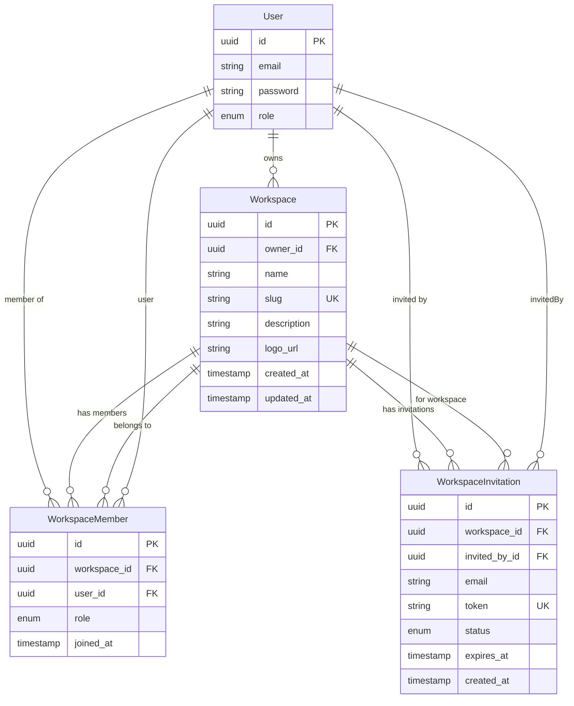
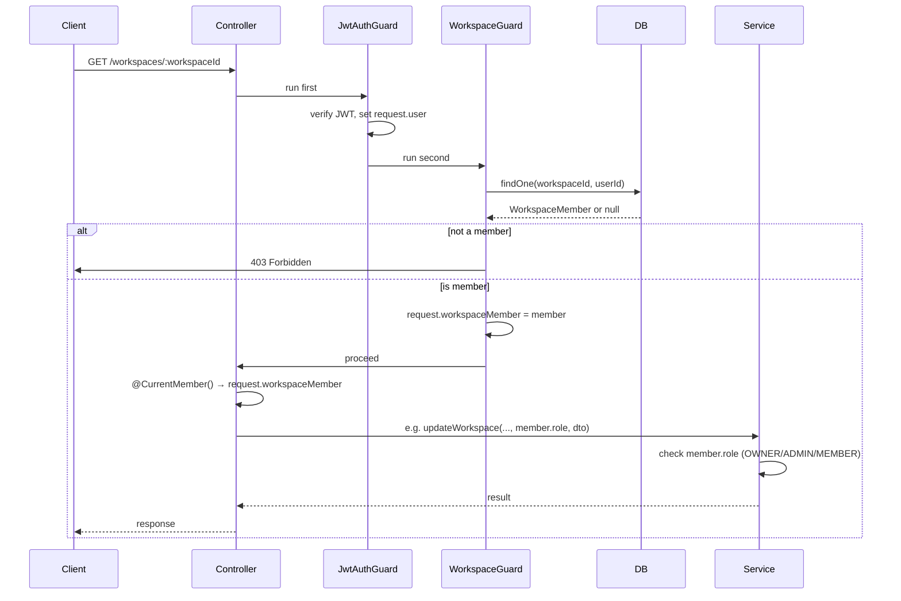
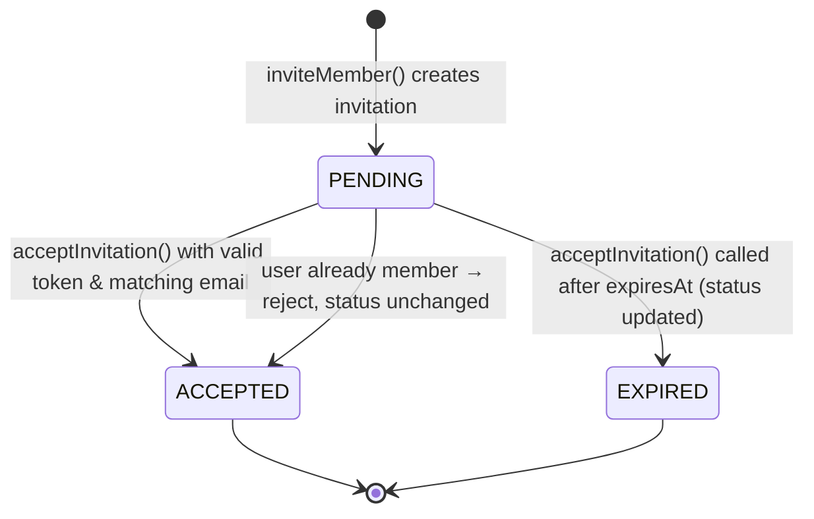

# Workspace Module Documentation

This document describes the workspace feature: multi-tenant workspaces, membership, roles, and email invitations.

---

## Table of Contents

1. [Overview](#overview)
2. [Module Structure](#module-structure)
3. [Entity Model & Relationships](#entity-model--relationships)
4. [Enums](#enums)
5. [Entities](#entities)
6. [DTOs](#dtos)
7. [Request Flow: Guard & Decorator](#request-flow-guard--decorator)
8. [API Routes](#api-routes)
9. [Service Methods & Permissions](#service-methods--permissions)
10. [Role Capabilities Matrix](#role-capabilities-matrix)
11. [Invitation Lifecycle](#invitation-lifecycle)

---

## Overview

The workspace module lets users:

- **Create workspaces** (name, optional description; slug is auto-generated).
- **List workspaces** they are a member of.
- **View, update, or delete** a workspace (with role-based rules).
- **Invite members** by email; invitees **accept** via a token (no pre-auth required for the invite itself).
- **Manage members**: remove members or change roles (OWNER / ADMIN / MEMBER).

Access to workspace-scoped routes is enforced by **JWT auth** plus a **WorkspaceGuard** that ensures the user is a member and attaches the membership (including role) to the request. Controllers use **`@CurrentMember()`** to read that membership without extra DB lookups.

---

## Module Structure

```
src/workspace/
├── entities/
│   ├── workspace.entity.ts
│   ├── workspace-member.entity.ts
│   └── workspace-invitation.entity.ts
├── enums/
│   ├── workspace-role.enum.ts
│   └── invitation-status.enum.ts
├── dto/
│   ├── create-workspace.dto.ts
│   ├── update-workspace.dto.ts
│   ├── invite-member.dto.ts
│   ├── update-member-role.dto.ts
│   └── accept-invitation.dto.ts
├── guards/
│   └── workspace.guard.ts
├── decorators/
│   └── current-member.decorator.ts
├── workspace.controller.ts
├── workspace.service.ts
└── workspace.module.ts
```

Shared type (used by guard and decorator):

```
src/types/workspace/
└── workspace-request.type.ts   # RequestWithWorkspaceMember
```

---

## Entity Model & Relationships



**Relationship summary:**

| From            | To                | Relation   | Description                          |
|----------------|-------------------|------------|--------------------------------------|
| User           | Workspace         | OneToMany  | A user owns many workspaces (owner)  |
| User           | WorkspaceMember   | OneToMany  | A user is a member of many workspaces|
| User           | WorkspaceInvitation | OneToMany| A user sends many invitations        |
| Workspace      | WorkspaceMember   | OneToMany  | A workspace has many members         |
| Workspace      | WorkspaceInvitation | OneToMany| A workspace has many invitations     |
| WorkspaceMember| Workspace         | ManyToOne  | Each membership belongs to one workspace |
| WorkspaceMember| User              | ManyToOne  | Each membership is for one user      |
| WorkspaceInvitation | Workspace    | ManyToOne  | Each invitation is for one workspace |
| WorkspaceInvitation | User (invitedBy) | ManyToOne | Each invitation is sent by one user |

---

## Enums

### WorkspaceRole

| Value   | Description |
|--------|-------------|
| `OWNER`  | Full control; only role that can delete workspace or change member roles. |
| `ADMIN`  | Can update workspace, invite and remove members (not owner, not other admins). |
| `MEMBER` | Default for new members; can view and use the workspace. |

### InvitationStatus

| Value     | Description |
|----------|-------------|
| `PENDING` | Invitation created, not yet accepted or expired. |
| `ACCEPTED`| User accepted; invitation no longer valid for joining. |
| `EXPIRED` | Past `expiresAt`; marked when someone tries to use an expired token. |

---

## Entities

### Workspace

| Field        | Type     | Constraints              | Description |
|-------------|----------|---------------------------|-------------|
| id          | uuid     | PK                        | Primary key. |
| ownerId     | uuid     | FK → User                 | Owner user id. |
| owner       | User     | ManyToOne                 | Owner relation. |
| name        | varchar  | required                  | Display name. |
| slug        | varchar  | unique                    | URL-safe identifier (derived from name). |
| description | varchar  | nullable                  | Optional description. |
| logoUrl     | varchar  | nullable                  | Optional logo URL. |
| members     | WorkspaceMember[] | OneToMany  | Members of this workspace. |
| invitations | WorkspaceInvitation[] | OneToMany | Pending/accepted/expired invitations. |
| createdAt   | timestamp| —                         | Creation time. |
| updatedAt   | timestamp| —                         | Last update time. |

### WorkspaceMember

| Field       | Type     | Constraints              | Description |
|------------|----------|---------------------------|-------------|
| id         | uuid     | PK                        | Primary key. |
| workspaceId| uuid     | FK → Workspace            | Workspace id. |
| workspace  | Workspace| ManyToOne                 | Workspace relation. |
| userId     | uuid     | FK → User                 | User id. |
| user       | User     | ManyToOne                 | User relation. |
| role       | WorkspaceRole | default MEMBER       | OWNER / ADMIN / MEMBER. |
| joinedAt   | timestamp| CreateDateColumn          | When the user joined. |

**Unique constraint:** `(workspaceId, userId)` — a user can only have one membership per workspace.

### WorkspaceInvitation

| Field       | Type     | Constraints    | Description |
|------------|----------|----------------|-------------|
| id         | uuid     | PK             | Primary key. |
| workspaceId| uuid     | FK → Workspace | Workspace id. |
| workspace  | Workspace| ManyToOne      | Workspace relation. |
| invitedById| uuid     | FK → User      | User who sent the invite. |
| invitedBy  | User     | ManyToOne      | Inviter relation. |
| email      | varchar  | —              | Email the invite was sent to. |
| token      | varchar  | unique         | One-time token for accepting. |
| status     | InvitationStatus | default PENDING | PENDING / ACCEPTED / EXPIRED. |
| expiresAt  | timestamp| —              | Invitation validity cutoff. |
| createdAt  | timestamp| CreateDateColumn | When the invite was created. |

---

## DTOs

| DTO                  | Purpose              | Fields |
|----------------------|----------------------|--------|
| **CreateWorkspaceDto**  | Create workspace     | `name` (required), `description` (optional) |
| **UpdateWorkspaceDto**  | Update workspace     | `name?`, `description?` (both optional) |
| **InviteMemberDto**     | Invite by email      | `email` (required, must be valid email) |
| **UpdateMemberRoleDto** | Change member role   | `role` (required; only `ADMIN` or `MEMBER`, not OWNER) |
| **AcceptInvitationDto** | Accept an invite     | `token` (required; invitation token) |

Validation uses `class-validator` (e.g. `@IsString()`, `@IsEmail()`, `@IsIn([...])`, `@MaxLength(...)`).

---

## Request Flow: Guard & Decorator

Routes that include a **`:workspaceId`** param are protected by **JwtAuthGuard** and **WorkspaceGuard**. The guard loads the current user’s membership for that workspace and attaches it to the request; the decorator reads it in the controller.



**Important:** The guard does **not** load relations (e.g. `workspace`). It only verifies membership and attaches the **WorkspaceMember** entity so that the controller and service can use `member.role` without an extra DB query.

**Type:** The extended request type is defined in `src/types/workspace/workspace-request.type.ts`:

```ts
export type RequestWithWorkspaceMember = Request & {
  user: JwtPayload;
  workspaceMember: WorkspaceMember;
};
```

Both the guard and the `@CurrentMember()` decorator use this type so that `request.workspaceMember` is correctly typed.

---

## API Routes

Base path: **`/workspaces`**. All routes except create/list/accept-invitation require a valid JWT. Routes with `:workspaceId` also require **WorkspaceGuard** (member of that workspace).

| Method | Path                                | Guards           | Description |
|--------|-------------------------------------|------------------|-------------|
| POST   | `/workspaces`                       | JwtAuthGuard     | Create workspace; caller becomes OWNER. |
| GET    | `/workspaces`                       | JwtAuthGuard     | List workspaces the user is a member of. |
| POST   | `/workspaces/invitations/accept`    | JwtAuthGuard     | Accept invitation by `token` (body). |
| GET    | `/workspaces/:workspaceId`          | JwtAuthGuard, WorkspaceGuard | Get one workspace (with members). |
| PATCH  | `/workspaces/:workspaceId`          | JwtAuthGuard, WorkspaceGuard | Update workspace (OWNER/ADMIN). |
| DELETE | `/workspaces/:workspaceId`          | JwtAuthGuard, WorkspaceGuard | Delete workspace (OWNER only). |
| POST   | `/workspaces/:workspaceId/invite`   | JwtAuthGuard, WorkspaceGuard | Invite member by email (OWNER/ADMIN). |
| DELETE | `/workspaces/:workspaceId/members/:userId` | JwtAuthGuard, WorkspaceGuard | Remove member (OWNER/ADMIN; cannot remove OWNER). |
| PATCH  | `/workspaces/:workspaceId/members/:userId/role` | JwtAuthGuard, WorkspaceGuard | Update member role (OWNER only). |

**Route order:** `POST /workspaces/invitations/accept` is registered **before** any `:workspaceId` route so that `"invitations"` is not interpreted as a workspace id.

---

## Service Methods & Permissions

| Method | Who can call (role) | Key behavior |
|--------|----------------------|--------------|
| **createWorkspace(userId, dto)** | N/A (any authenticated user) | Creates workspace, generates unique slug from name, adds creator as OWNER. |
| **getMyWorkspaces(userId)** | N/A | Returns all workspaces where the user has a WorkspaceMember row. |
| **getWorkspace(workspaceId, userId)** | Any member | Verifies membership; returns workspace with members (and owner). |
| **updateWorkspace(..., memberRole, dto)** | OWNER or ADMIN | Updates name/description. |
| **deleteWorkspace(..., memberRole)** | OWNER only | Deletes workspace (and cascades as per TypeORM). |
| **inviteMember(..., memberRole, dto)** | OWNER or ADMIN | Creates invitation with unique token, 7-day expiry; rejects if email already member. |
| **acceptInvitation(token, userId)** | N/A (token-based) | Validates token, expiry, and email match; creates MEMBER; marks invitation ACCEPTED. |
| **removeMember(..., memberRole, targetUserId)** | OWNER or ADMIN | Removes target; cannot remove OWNER; ADMIN cannot remove another ADMIN. |
| **updateMemberRole(..., memberRole, targetUserId, dto)** | OWNER only | Sets target role to ADMIN or MEMBER; cannot set or change OWNER. |

The service receives `memberRole` from the controller (from `@CurrentMember() member` → `member.role`), so it does not perform an extra membership lookup.

---

## Role Capabilities Matrix

| Action                    | OWNER | ADMIN | MEMBER |
|---------------------------|:-----:|:-----:|:------:|
| View workspace            | ✅    | ✅    | ✅     |
| Update workspace (name, description) | ✅ | ✅ | ❌ |
| Delete workspace          | ✅    | ❌    | ❌     |
| Invite members            | ✅    | ✅    | ❌     |
| Remove members            | ✅    | ✅*   | ❌     |
| Update member roles       | ✅    | ❌    | ❌     |

\* ADMIN cannot remove the OWNER or another ADMIN.

---

## Invitation Lifecycle



1. **Create:** OWNER/ADMIN calls `POST /workspaces/:workspaceId/invite` with `{ "email": "..." }`. Service generates a unique token and sets `expiresAt` (e.g. 7 days).
2. **Accept:** User (logged in) calls `POST /workspaces/invitations/accept` with `{ "token": "..." }`. Service checks:
   - Invitation exists and status is PENDING.
   - Not expired (if expired, sets status to EXPIRED and throws).
   - Logged-in user’s email matches invitation email.
   - User is not already a member.
   Then creates a WorkspaceMember with role MEMBER, sets invitation status to ACCEPTED, and returns the workspace.
3. **Expired:** If someone uses a token after `expiresAt`, the service updates status to EXPIRED and returns an error.

---

## Summary

- **Entities:** Workspace, WorkspaceMember, WorkspaceInvitation; relations to User as owner, member, and inviter.
- **Access:** JWT + WorkspaceGuard on `:workspaceId` routes; guard attaches `request.workspaceMember` (no relation preload).
- **Roles:** OWNER (full control), ADMIN (manage workspace and members), MEMBER (default).
- **Invitations:** By email, token-based accept; 7-day expiry; status PENDING → ACCEPTED or EXPIRED.

For implementation details, see the source files under `src/workspace/` and `src/types/workspace/`.
